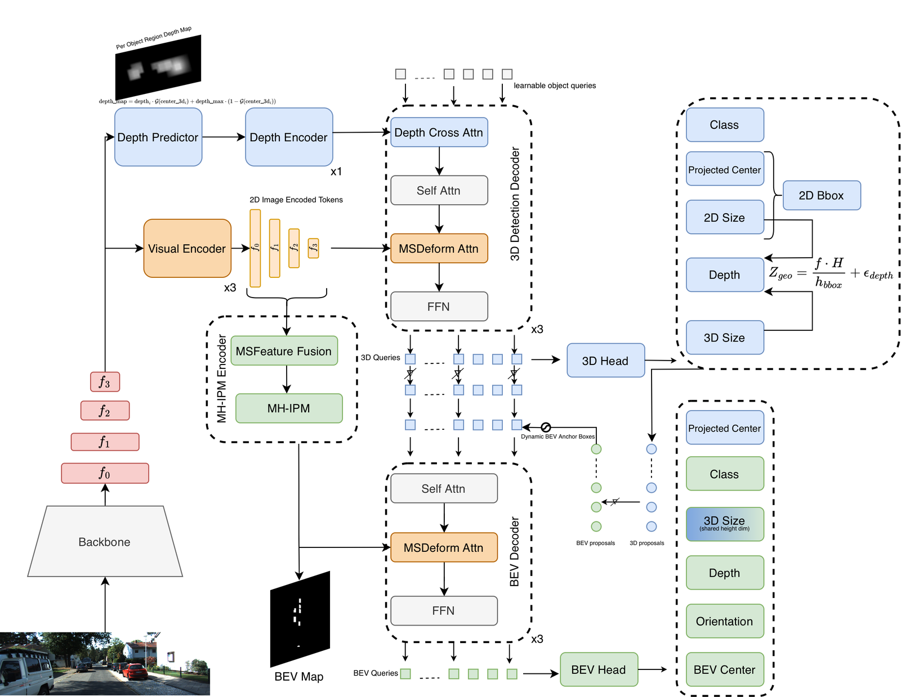
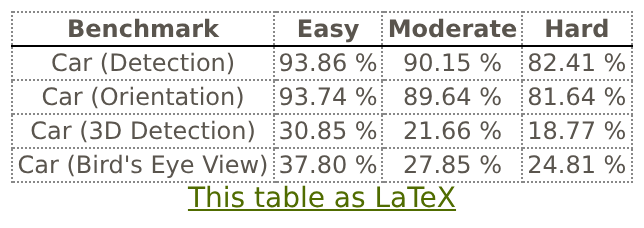

# MonoMIP: Multi-Height Inverse Perspective Mapping for Monocular 3D Object Detection


This repository hosts the official implementation of MonoMIP: Multi-Height Inverse Perspective Mapping for Monocular 3D Object Detection, based on the excellent work [MonoDGP](https://github.com/PuFanqi23/MonoDGP). In this work, we propose MonoMIP, a dual-decoder framework that adds Bird's-Eye View (BEV) reasoning to a depth-guided transformer. Its BEV features are built by inverse perspective mapping at multiple height planes, from the ground up to roof height. How an object's projected features vary across these planes depends on its depth, which gives the model a geometric cue for occupancy and depth.


<div align="center">
  
</div>


Results on the KITTI val set (Car):

<table>
    <tr>
        <td rowspan="2" align="center">Models</td>
        <td colspan="3" align="center">Val, AP<sub>3D|R40</sub></td>
    </tr>
    <tr>
        <td align="center">Easy</td>
        <td align="center">Mod.</td>
        <td align="center">Hard</td>
    </tr>
    <tr>
        <td align="center">MonoMIP</td>
        <td align="center">33.26%</td>
        <td align="center">25.84%</td>
        <td align="center">23.15%</td>
    </tr>
    <tr>
        <td align="center">MonoMIP-DiagCorr</td>
        <td align="center">35.47%</td>
        <td align="center">27.19%</td>
        <td align="center">24.02%</td>
    </tr>
</table>


Test results submitted to the official [KITTI Benchmark](https://www.cvlibs.net/datasets/kitti/eval_object_detail.php?&result=c3993fdd297f9bbc95f22714468a643c378e8049):

Car category:
<div>
  
</div>


## Installation
1. Clone this project and create a conda environment:
    ```bash
    git clone https://github.com/imemmul/MonoMIP.git
    cd MonoMIP

    conda create -n monomip python=3.11
    conda activate monomip
    ```

2. Install pytorch and torchvision matching your CUDA version:
    ```bash
    # For example, we adopt torch 2.5.1+cu121
    pip install torch==2.5.1 torchvision==0.20.1 --index-url https://download.pytorch.org/whl/cu121
    ```

3. Install requirements and compile the deformable attention:
    ```bash
    pip install -r requirements.txt

    cd lib/models/monomip/ops/
    bash make.sh

    cd ../../../..
    ```

4. Download [KITTI](https://www.cvlibs.net/datasets/kitti/eval_object.php?obj_benchmark=3d) datasets and prepare the directory structure as:
    ```bash
    │MonoMIP/
    ├──...
    ├──data/KITTI/
    │   ├──ImageSets/
    │   ├──training/
    │   │   ├──image_2
    │   │   ├──label_2
    │   │   ├──calib
    │   ├──testing/
    │   │   ├──image_2
    │   │   ├──calib
    ```
    You can also change the data path at "dataset/root_dir" in the configs.

## Get Started

### Train
You can modify the settings of models and training in `configs/monomip_car.yaml` and indicate the GPU in `train.sh`:
  ```bash
  bash train.sh configs/monomip_car.yaml
  ```
### Test
The best checkpoint (`outputs/monomip_car/monomip/checkpoint_best.pth`) will be evaluated as default:
  ```bash
  bash test.sh configs/monomip_car_eval.yaml
  ```
For MonoMIP-DiagCorr, use the `monomip_diagcorr_car` configs and output folder instead.

## Acknowledgment
This repo benefits from the excellent works [MonoDGP](https://github.com/PuFanqi23/MonoDGP), [MonoDETR](https://github.com/ZrrSkywalker/MonoDETR) and [MonoCoP](https://github.com/alanzhangcs/MonoCoP).
